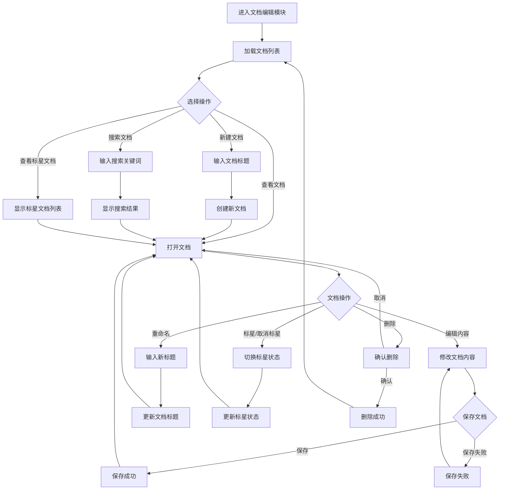

## 文档编辑模块流程图说明

### 核心流程
1. **进入文档编辑模块**：用户登录后进入主页面，显示文档编辑模块
2. **加载文档列表**：系统自动加载用户的所有文档
3. **选择操作**：用户可以选择查看文档、新建文档、搜索文档或查看标星文档
4. **文档操作**：用户打开文档后，可以进行编辑内容、重命名、标星/取消标星、删除等操作
5. **保存文档**：用户编辑文档后可以保存，保存成功后返回文档编辑状态，保存失败则提示错误并允许重新保存

### 主要功能
- **文档列表管理**：查看所有文档、查看标星文档、搜索文档
- **文档操作**：新建文档、打开文档、删除文档、标星/取消标星文档、重命名文档
- **文档编辑**：编辑文档内容、保存文档

### 流程说明
1. **新建文档**：用户输入文档标题后，系统创建新文档并自动打开
2. **搜索文档**：用户输入关键词后，系统显示匹配的文档列表，用户可以从中选择打开
3. **标星文档**：用户可以查看已标星的文档列表，从中选择打开
4. **文档编辑**：用户打开文档后可以编辑内容，编辑完成后可以保存
5. **文档管理**：用户可以对文档进行重命名、标星/取消标星、删除等操作

### 错误处理
- **保存失败**：如果保存文档失败，系统会提示错误，用户可以重新尝试保存
- **删除确认**：删除文档前会弹出确认对话框，防止误操作

该流程图覆盖了文档编辑模块的主要功能和流程，符合用户提供的流程图风格。